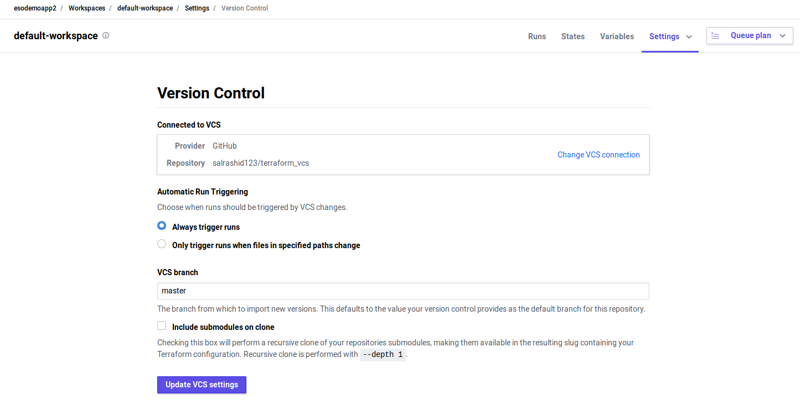
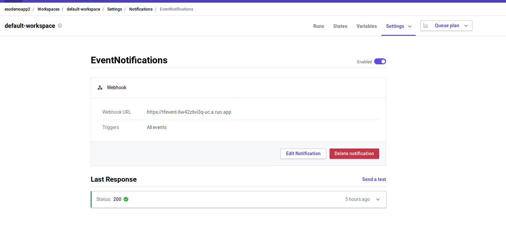
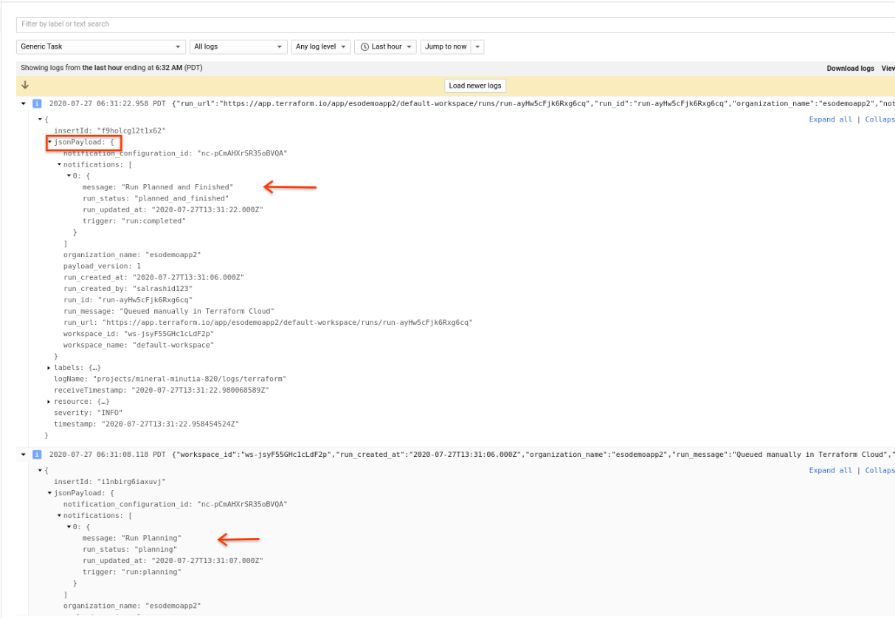

## Using Terraform Cloud Webhook with Google Cloud Logging

Tutorial to emit [Terraform Cloud](https://www.terraform.io/docs/cloud/index.html) webhook events to [Google Cloud Logging](https://cloud.google.com/logging/docs).

This repo isn't anything groundbreaking but just goes through the steps to setup terraform webhook such that they they appear in GCP Cloud Logging as [Structured logs](https://cloud.google.com/logging/docs/structured-logging).

One the logs are in GCP, you can export them to BQ or re-emit them as pubsub messages to kick off any secondary workflows.

The architecture is basic:

(user or CI/CD) triggers `plan/apply` --> `Terraform Cloud` --> `Cloud Run` --> `Cloud Logging`

Cloud Run will:
* Accept only requests that carry the valid `HMAC-SHA256` that was configured in Terraform
* Convert the Terraform JSON Payload to a GCP Structured log and emit them to its own log type.


>> This repo is not supported by Google

### Setup

Its assumed you already have a Terraform Cloud account setup as well as a GCP project.

This tutorial will setup cloud run, cloud logging, terraform cloud which is triggered manually (or automatic) to run a basic terraform template.

https://github.com/salrashid123/terraform_vcs

#### Create Service Account for Cloud run

```bash
$ export PROJECT_ID=`gcloud config get-value core/project`
$ gcloud iam service-accounts create tf-run-server --display-name "Service Account for Cloud Run"
$ gcloud projects add-iam-policy-binding $PROJECT_ID \
   --member=serviceAccount:tf-run-server@$PROJECT_ID.iam.gserviceaccount.com \
   --role=roles/logging.logWriter
```

#### Build and Deploy Cloud RUn

First edit `server.go` and update the HMAC password to whatever you want

```golang
const (
  key               = "password1"
)
```

build and deploy

```bash
docker build -t gcr.io/$PROJECT_ID/tfevent .
docker pushgcr.io/$PROJECT_ID/tfevent


gcloud beta run deploy tfevent \
  --image gcr.io/$PROJECT_ID/tfevent  \
  --allow-unauthenticated \
  --region us-central1  --platform=managed 
```

Note, we are deploying cloud run without [authentication enabled](https://cloud.google.com/run/docs/authenticating/overview).  We're doing this because Terraform Cloud does not support the same auth mechanism Run uses (`OIDC`) but instead its `HMAC-SHA512` (see [Notification Authenticity](https://www.terraform.io/docs/cloud/api/notification-configurations.html#notification-authenticity))

Once you deploy, copy the Cloud Run URL.

#### Configure Terraform Cloud for Webhook

1. Configure a [Workspace in Terraform Cloud](https://www.terraform.io/docs/cloud/workspaces/index.html)
  
  In the following example, its `default-workspace`.  Set the Terraform Working Directory the path under the source.  In my case, its `hello_world`.

  ![images/workspace.png]

  The git repo used for this tutorial has has the terraform files under the `hello_world` directory.  (the script doesn't do anything, really (see for your self))
  ```bash
  $ git remote -v
  origin	https://github.com/salrashid123/terraform_vcs.git (fetch)
  origin	https://github.com/salrashid123/terraform_vcs.git (push)

  $ tree
  .
  ├── hello_world
  │   └── default.tf
  └── README.md
  ```

2. Set version control source
  
  In the following, i used the git repo here on `master` branch

  

3. Configure Notifications

   Setup a Notification with the URL of the Cloud Run instance and the HMAC passphrase you used.
   Specify the 

   


4. Trigger

   In the following, the trigger was a "Plan" that was triggered manually.
    


### Verify Cloud Logging  

The trigger should have called cloud run.  You can check that cloud run was called by checking Run logs.

However, this application will *reemit* the payload it receives from Terraform as structured logs to a custom resource_type called [generic_task](https://cloud.google.com/monitoring/api/resources#tag_generic_task).

To see structured logs for Terraform, navigate to `Generic Task` logs in cloud logging.  You should see all the various events emitted:




### Enhancements

In this case Cloud Run parsed the terraform event and resent it to Cloud Logging.  You can easily emit other types of data such as Pub/Sub, Cloud Task or even as a [Cloud Event](https://cloudevents.io/) downstream (see example [here](https://gist.github.com/salrashid123/92adfda447f3c023efdaf6c320603aa1#file-main-go-L69))


